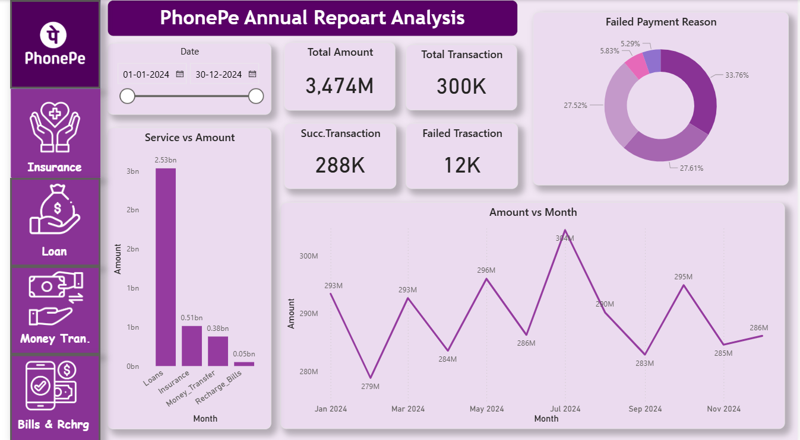

An interactive **Power BI dashboard project** analyzing PhonePe’s annual transaction data across multiple services including:

- 💸 Money Transfer
- 🏦 Loans
- 🛡️ Insurance
- 📺 Bills & Recharge

This project focuses on identifying **transaction trends, service performance, payment failures, and business growth patterns** using data visualization and KPI analysis.

---

## 📌 Project Objective

The goal of this project is to:

- Analyze annual transaction volume and amount
- Identify high-performing services
- Understand transaction success vs failure trends
- Detect major payment failure reasons
- Track month-wise growth patterns
- Generate actionable business insights

---

## 🛠 Tools & Technologies Used

- **Power BI Desktop**
- **Power Query (Data Cleaning & Transformation)**
- **DAX (Calculated Measures & KPIs)**
- **Excel (Data Preparation)**

---

# 📊 Overall Dashboard Overview

### 🔹 Key KPIs (Annual Summary)

| Metric | Value |
|--------|-------|
| Total Transaction Amount | 3,474M+ |
| Total Transactions | 300K+ |
| Successful Transactions | 288K |
| Failed Transactions | 12K |
| Success Rate | ~96% |

### 🔍 Insights:
- Very high success rate (~96%)
- Strong transaction consistency across months
- Failures are controlled but still actionable

---

# 💸 Money Transfer Analysis

### 📌 Highlights

| Metric | Value |
|--------|-------|
| Total Money Transfer | 378M |
| Total Transactions | 150,000 |
| Success Rate | 95.98% |

### 🔎 Insights

- Monthly transfer amount remains stable between **29M–32M**
- Peak month observed in **May**
- Transfer types (UPI ID, QR Code, Mobile, Self Account) show balanced usage

### 🚨 Business Problem Identified

- Minor transaction drop observed in February
- Payment failures still present (~4%)

### 💡 Suggested Improvement

- Improve server stability during peak traffic
- Strengthen backend for month-start transaction spikes

---

# 🏦 Loan Services Analysis

### 📌 Highlights

| Loan Type | Total Amount |
|-----------|-------------|
| Auto Loan | 644M |
| Mutual Funds | 634M |
| Gold Loan | 632M |
| Credit Score | 622M |

### 🔎 Insights

- Auto Loans lead in total disbursed amount
- All loan categories show consistent monthly demand
- Strong loan portfolio diversification

### 🚨 Business Problem Identified

- Loan growth is steady but not accelerating
- Seasonal spikes not fully utilized

### 💡 Suggested Strategy

- Offer festival-based loan promotions
- Introduce targeted marketing for high-value customers

---

# 🛡️ Insurance Analysis

### 📌 Highlights

| Insurance Type | Premium Amount |
|----------------|---------------|
| Car | 124M |
| Term Life | 123M |
| Bike | 122M |
| Health | 122M |

### 🔎 Insights

- Very balanced premium distribution
- Car insurance slightly leading
- Monthly trend stable between 1.6M–2.1M

### 🚨 Business Problem Identified

- Low premium growth momentum
- Flat monthly performance

### 💡 Suggested Strategy

- Cross-sell insurance during loan processing
- Offer bundled insurance discounts

---

# 📺 Bills & Recharge Analysis

### 📌 Highlights

| Service | Amount |
|----------|--------|
| Electricity | 12.82M |
| DTH | 12.64M |
| Mobile | 12.63M |
| Cable TV | 12.61M |

### 🔎 Insights

- Uniform usage across all services
- Consistent monthly billing trend
- No heavy dependency on a single bill category

---

# ❌ Payment Failure Analysis

### Major Failure Reasons:

| Reason | Approx % |
|--------|----------|
| Wrong PIN / Wrong Info | ~33–34% |
| Server Error | ~33% |
| Bank Denied / Insufficient Balance | ~32% |

### 🚨 Core Issue

Failures are evenly distributed → indicates:
- User input issues
- Backend processing delays
- Bank-level authorization issues

### 💡 Business Recommendation

- Improve user error messaging
- Strengthen bank API integration
- Introduce real-time failure retry system

---

# 📈 Month-wise Trend Analysis

Across all services:

- Strongest performance in **May & October**
- Slight dip in **February**
- Stable growth pattern throughout the year
- No extreme volatility (Healthy business signal)

---

# 📁 Repository Structure

---

# 🎯 Conclusion

This project demonstrates:

- End-to-end dashboard development
- KPI identification & tracking
- Business problem detection
- Data-driven solution recommendations
- Strong visualization & storytelling skills

It reflects practical **Business Intelligence and Data Analytics capabilities**.

---

# 👨‍💻 Created By

**Ritik Sharma**
